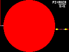

+++
title = "Языки программирования, про которые вы (возможно) не знали — выпуск 3"
date = 2021-03-22
+++

После большого спешла и большого перерыва возвращаемся к традиционному формату — три языка из разных
категорий. Сегодня в меню: PostScript, Pony и Piet — все три на P.

<!-- more -->

### Язык первый, (неожиданно) практичный — PostScript {#postscript}

Сайт: не думаю

> PostScript (PS) is a page description language in the electronic publishing and desktop publishing
> business. It is a dynamically typed, concatenative programming language.
>
— *Википедия*

#### Summary {#postscript-summary}

PostScript это стековый, динамический язык программирования, но любим мы его не за это. Дело в том,
что это тот язык, на котором (многие) принтеры принимают команды. Также он является частью
пайплайна рендера LaTeX в PDF, и используется как промежуточный язык во многих других программах.

#### Как выглядит? {#postscript-looks}

```postscript
%!PS-Adobe-3.0 EPSF-3.0
%%BoundingBox: 0 0 508 608
%%Creator: Goldstein
%%Title: Tree
%!
1.1 setlinewidth
/a 1.15 def
/a2 1.1 def
/b a 1 sub def
/b2 a2 1 sub def
/k 20 def
/fc 1 def
/initrandom
{
    realtime srand
} def
/getrandom
{
    rand exch mod
} def 
/setcolor {
    dup dup 250 eq { 2 div } if 250
    div dup 0.1 sub exch 0.5 exch sub 0 setrgbcolor
    fc getrandom
    1 eq exch 30 lt and {0.5 0 0.5 setrgbcolor} if
} def
% Дальнейший код урезан
```

Впрочем, когда мы говорим про PostScript, «как выглядит» может иметь несколько значений.
Вот результат выполнения полной версии программы выше:


#### Хайлайты {#postscript-highlights}

* PostScript это Тьюринг-полный стековый язык программирования. Несмотря на то, что основное его
  предназначение — описание картинок, его можно заставить делать что угодно.

* В PostScript нет никакого рода переменных. Все значения хранятся на одном стеке, с которого достаются
  по мере необходимости. Для работы со стеком есть отдельный набор инструкций — например, `dup`
  дублирует верхний элемент стека, `exch` меняет два верхних, `pop` удаляет верхний, а `a b roll`
  берёт `b` верхних элементов и переставляет их за `a - b` следующих (таким образом, `exch` это
  `2 1 roll`).

* Так как язык постфиксный, все выражения задаются в обратной польской нотации. Это приводит не только
  к операциям вида `2 2 +`, но и к гораздо более странным вроде `<cond> { <body> } if`.

* `if` не является специальным синтаксическим элементом. Это просто функция, которая принимает на
  вход условие и другую функцию.

* Впрочем, «функция» это тоже не какой-то специальный конструкт. Любая последовательность инструкций,
  заключённая в фигурные скобки, не выполняется мгновенно, а кладётся на стек.

  Чтобы иметь возможность её вызвать, ей нужно дать имя. Это делается с помощью функции `def`,
  которая берёт со стека символ (название переменной) и значение, и создаёт новую переменную.
  Например:
  
  ```postscript
  % Литерал «символа» задаётся с помощью `/`
  /pi 3.14 def
  % В дальнейшем мы можем использовать `pi`, чтобы получить `3.14`
  % Например, следующий код:
  /tau pi dup add def
  % Будет исполняться так:
  % 1. Сначала на стек попадёт символ `/tau`.
  % 2. Потом мы кладём на него `3.14` и дублируем.
  % 3. Сейчас у нас на стеке `/tau` и два раза `3.14`.
  % 4. Функция `add` забирает два верхних элемента со стека
  %    и кладёт туда результат сложения.
  % 5. Теперь на стеке `/tau` и `6.28`.
  % 6. Функция `def` забирает оба элемента со стека и создаёт
  %    переменную.

  % Точно так же мы можем объявлять функции:
  /double { dup add } def
  % Теперь слово `double` вызывает инструкции `dup add`.
  % Соответственно, объявление `tau` можно переписать как:
  /tau pi double def
  ```

* Легко заметить, что «функции», будучи просто последовательностями инструкций, не принимают
  аргументов в привычном смысле слова. Вместо этого они ожидают какой-то набор значений на вершине
  стека, и возвращают ответ, положив его на стек.

* Очевидно, в PostScript встроены возможности для рисования — функции вроде `setcolor` и `lineto`.
  Не столь очевидно, что в языке также предусмотрена возможность ввода из файла (в частности с
  клавиатуры, с помощью специального файла `%stdin`) и вывода на консоль. Понятно, что принтер или
  программа для просмотра картинок не смогут корректно реализовать эту возможность, но при запуске
  интерпретатора (например, [Ghostscript]) из консоли, этим можно пользоваться.

* К сожалению, большая часть PostScript, который генерируют программы, гораздо менее человекочитаема.
  Обычно автоматически сгенерированный PostScript выглядит примерно так:

  ```auto-generated postscript
  currentfile /ASCII85Decode filter /LZWDecode filter cvx exec
  J.'GP1)YJ2:a-L/6rF=&5]f",9VMV4PfsINPg$$lJV;<[.@O%03.smQ(5rht"Yl-EjCpYCbf1<)
  c6j?bR*MTSOd+XC1)`i!8/)[G#_bVh`j9ZtmVY1>Vc1_1!ej$n_-lc">Vn_g3WbAM)4]4"@PjL3
  [U;qM@2,bu$q=/UUtllhdHd$j!L3(`1eH]do:_i*EtD=6Zhb+A"W0@X#3.4]i\4pu*DF<YV7bt&
  ```

[Ghostscript]: https://ghostscript.com

### Язык второй, (скорее) исследовательский — Pony {#pony}

Сайт: <https://ponylang.io>

> Pony is an open-source, object-oriented, actor-model, capabilities-secure,
> high-performance programming language.
>
— *Официальный сайт Pony*

#### Summary {#pony-summary}

Pony — это язык, ориентированный на то, чтобы сделать конкурентное программирование доказуемо
корректным. Кроме классических гарантий отсутствия неопределённого поведения и data races, он также
заявляет гарантию отсутствия дедлоков. Достигается это с помощью переосмысления всей структуры
программы — в основе всего у Pony лежат _акторы_. К сожалению, в языке не решены некоторые базовые
проблемы такого подхода, из-за чего многие простые действия становятся неэргономичными. Кроме того,
это довольно сложный язык.

#### Как выглядит? {#pony-looks}

```pony
use "collections"

actor Counter
  var _count: U32

  new create() =>
    _count = 0

  be increment() =>
    _count = _count + 1

  be get_and_reset(main: Main) =>
    main.display(_count)
    _count = 0

actor Main
  var _env: Env

  new create(env: Env) =>
    _env = env

    var count: U32 = try env.args(1)?.u32()? else 10 end
    var counter = Counter

    for i in Range[U32](0, count) do
      counter.increment()
    end

    counter.get_and_reset(this)

  be display(result: U32) =>
    _env.out.print(result.string())
```

#### Хайлайты {#pony-highlights}

* Pony — строго, статически типизированный язык. Компилируется в нативные бинарники. Поддерживает
  полиморфизм через интерфейсы: как номинативные, так и структурные. В Pony нет ADT (только union
  types), есть достаточно мощная система дженериков.

* Экосистема довольно небольшая, библиотек практически нет.

* Исполнение кода в Pony происходит в _акторах_. Актор — это класс, у которого есть очередь сообщений.
  Когда на акторе вызывается _поведение_ (метод, объявленный с помощью ключевого слова `be`), оно
  не выполняется мгновенно, а ставится в очередь. Поведение не может возвращать значения, потому что
  его вызов «завершается» сразу же, до того, как код будет действительно выполнен. Этим свойством
  и объясняется гарантия отсутствия дедлоков: так как вызов поведения неблокирующий, и в языке нет
  способа ждать выполнения чего-то, то дедлока не может произойти.

* Очевидное следствие: если в языке нет способа ждать чего-либо, то интуитивный способ реализовывать
  ввод данных из внешнего мира, вроде

  ```python
  name = input()
  print(name)
  ```
  
  не может работать: в самом деле, для этого нам пришлось бы ожидать окончания выполнения `input()`.
  Pony решает эту проблему через передачу коллбэков в методы. Например, вот как документация
  стандартной библиотеки предлагает использовать STDIN:

  ```pony
  env.input(
    // Создаём анонимный класс, который реализует интерфейс
	// `InputNotify`, и экземпляр этого класса
    object iso is InputNotify
	  // Реализуем функцию, которая принимает на вход
	  // байтовый массив входных данных
      fun ref apply(data: Array[U8] iso) =>
	    // Когда её вызывают, выводим полученные
        // данные на экран, преобразовав к строке
        env.out.write(String.from_iso_array(consume data))
    end,
	// Говорим, что хотим получать ввод блоками по 512 байт
    512)
  ```

  Язык и стандартная библиотека не предоставляют никакого синтаксического сахара для облегчения
  этого процесса.

* Акторы выполняются в пуле тредов. На каждом треде в один момент времени выполняется только один
  актор, каждый актор одновременно выполняет только одно поведение (обрабатывает только одно сообщение).
  Переключение контекста между акторами происходит только при завершении поведения — если обработка
  какого-то сообщения у актора занимает очень много времени, он всё это время занимает один из тредов,
  не позволяя другим акторам его использовать.

* Отсутствие data races обеспечивается довольно сложной системой reference capabilities. Объяснять
  её целиком было бы слишком долго для формата этого дайджеста, но основная суть заключается в том,
  что для каждой ссылки на объект статически известно:

  1. Могут ли существовать ссылки на этот объект, через которые его можно прочитать
  2. Может ли кто-то через них писать
  3. Могут ли они находиться в другом акторе

  и это определяет

  1. Можем ли мы читать информацию из этого объекта
  2. Можем ли мы писать информацию в этот объект
  3. Можем ли мы передать эту ссылку в другой актор
  4. Какой reference capability будет у ссылки, которую мы получим, если скопируем эту.
     Это необязательно такой же, потому что копирование ссылки изменяет первое и, опционально,
	 второе свойство из списка выше. Например, копирование уникальной ссылки `iso` даст ссылку
	 `tag`, через которую нельзя ни читать, ни писать.

* Всего в Pony 6 reference capabilities, каждый из которых может быть с суффиксом `^`, `!` или без
  суффикса вообще.
  Зато нет лайфтаймов: управление памятью происходит с помощью GC.

* Оператор `=` в Pony возвращает старое значение левого операнда, т. е. `a = b` возвращает `a`.
  Кроме того, что это позволяет легко обменять два значения местами (через `a = b = a`), это ещё
  и незаменимо при работе с уникальными ссылками:

  ```pony
  // `b` — уникальная (`iso`) ссылка
  // Это выражение создаст копию ссылки `b` в переменной `a`.
  // Копия будет иметь reference capability `tag`
  // Старое значение `a` теряется
  a = b
  // Это выражение переместит ссылку `b` в переменную `a`.
  // Перемещённое значение сохраняет reference capability `iso`
  // Старое значение `a` теряется
  a = consume b
  // Это выражение переместит ссылку `b` в переменную `a`
  // Перемещённое значение имеет reference capability `iso`
  // Старое значение `a` теперь в `c`
  c = a = consume b
  ```

  Это свойство называется destructive read.

* В Pony у бинарных операций нет приоритетов: выражение `2 + 2 * 2` это не 6, не 8, а ошибка
  синтаксиса. Это решение было принято, чтобы минимизировать вероятность случайных ошибок из-за
  перепутанных приоритетов: хотя для сложения и умножения правила помнят все, для других операторов
  они не настолько очевидные. Например, взаимные проритеты побитового сдвига и побитового ИЛИ
  мало кто может вспомнить сразу.

  Унарные операторы всегда имеют приоритет над бинарными.

* Чтобы арифметические операции были определены на всех возможных значениях аргументов, Pony
  несколько отступает от традиционных математических правил. В частности, `x / 0 = 0`. Чтобы
  обработать подобные случаи, есть два дополнительных набора арифметических операторов: `/?` при
  попытке деления на ноль вызовет ошибку, а `/~` — неопределённое поведение.

* Кстати, про ошибки — несмотря на то, что основная обработка ошибок происходит через union types
  (функция возвращает `ResultType | ErrorType` или `ResultType | None`), для них также существует
  своя отдельная система.

  Ключевое слово `error` возвращает из функции ошибку. К ней нельзя «прикрепить» никакой информации.
  На месте вызова ошибку нужно либо в явном виде обработать через `try-else`, либо отправить дальше с
  помощью оператора `?`.

  ```pony
  fun returnsError(): I32? =>
    error

  fun checksError(): I32 =>
    try
	  returnsError()
	else
	  0
	end

  fun alsoReturnsError(): I32? =>
    2 + returnsError()?
  ```

### Язык третий, (однозначно) эзотерический — Piet {#piet}

Страница на Esolangs: <https://esolangs.org/wiki/Piet>

#### Summary {#piet-summary}

Piet — стековый Тьюринг-полный язык программирования, который оперирует над числами. Самое (и, возможно,
единственное) его интересное свойство заключается в том, что код на Piet это не текст, а картинка[^ref1].

#### Как выглядит? {#piet-looks}

Нет, это не результат работы программы, это _и есть_ программа. Как можно догадаться, она выводит
классическое приветствие.


#### Хайлайты {#piet-highlights}

* Piet — стековый язык, наподобие [FORTH] или, собственно, PostScript. В нём есть 17 довольно типичных
  инструкций, которые манипулируют стеком, включая инструкции ввода-вывода, плюс инструкции, которые
  поворачивают основной и дополнительный указатели.

* Программы на Piet состоят из _коделов_ (≈ увеличенных пикселей) 20 возможных цветов. Инструкции
  задаются не цветами, а изменением оттенка и светлоты цвета при переходе из одного кодела в другой.

* Указатель на инструкцию стартует в левом верхнем углу программы, повёрнутый вправо. На каждом
  шаге он перемещается на один кодел в своём направлении. Если это невозможно, то для выбора между
  равноправными вариантами (например, поворотом направо или налево) используется дополнительный
  указатель, codel chooser.

* Белый и чёрный цвета — специальные. Белый цвет игнорируется интерпретатором, указатель просто
  проходит сквозь него. Чёрный выполняет роль «стены». Если интерпретатор оказался в ситуации, в которой
  указатель «заперт» стенами и не может никуда перейти, выполнение программы завершается.
  Это единственный способ завершить выполнение программы.

* На Piet были написаны довольно сложные программы: например, игра «Жизнь», интерпретатор брейнфака
  и даже квайн. Полюбоваться на программы на Piet можно в [галерее][piet-gallery].

* Это не то чтобы хайлайт языка, но мне очень нравится вот эта программа, которая вычисляет число π
  методом буквального подсчёта количества пикселей в круге:

  

[FORTH]: https://en.wikipedia.org/wiki/FORTH
[piet-gallery]: https://www.dangermouse.net/esoteric/piet/samples.html

---
[^ref1]: Ура, мне не придётся искать синтаксис для подсветки!
